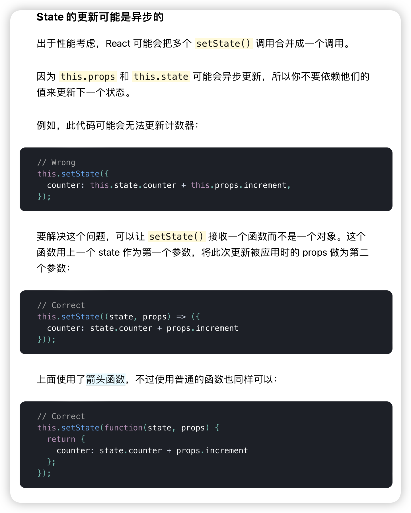

## 1. setState

### setState更新状态的2种写法

```
setState(stateChange, [callback])------对象式的setState
	        1.stateChange为状态改变对象(该对象可以体现出状态的更改)
	        2.callback是可选的回调函数, 它在状态更新完毕、界面也更新后(render调用后)才被调用
```
```
setState(updater, [callback])------函数式的setState
	        1.updater为返回stateChange对象的函数。
	        2.updater可以接收到state和props。
	        4.callback是可选的回调函数, 它在状态更新、界面也更新后(render调用后)才被调用。
```
> 总结:
> 1.对象式的setState是函数式的setState的简写方式(语法糖)
> 2.使用原则：
> 如果新状态不依赖于原状态 ===> 使用对象方式
> 如果新状态依赖于原状态 ===> 使用函数方式
> 如果需要在setState()执行后获取最新的状态数据, 要在第二个callback函数中读取

https://zh-hans.reactjs.org/docs/state-and-lifecycle.html#state-updates-may-be-asynchronous



# 2. lazyLoad

117集 lazyload 先放一放 因为我用的是react-router-dom 6 有新特征

# 3. Hooks

#### 1. React Hook/Hooks是什么?

```
Hook是React 16.8.0版本增加的新特性/新语法
可以让你在函数组件中使用 state 以及其他的 React 特性
```

#### 2. 三个常用的Hook

```
State Hook: React.useState()
Effect Hook: React.useEffect()
Ref Hook: React.useRef()
```

#### 3. State Hook

```
State Hook让函数组件也可以有state状态, 并进行状态数据的读写操作
语法: const [xxx, setXxx] = React.useState(initValue)  
useState()说明:
        参数: 第一次初始化指定的值在内部作缓存
        返回值: 包含2个元素的数组, 第1个为内部当前状态值, 第2个为更新状态值的函数
setXxx()2种写法:
        setXxx(newValue): 参数为非函数值, 直接指定新的状态值, 内部用其覆盖原来的状态值
        setXxx(value => newValue): 参数为函数, 接收原本的状态值, 返回新的状态值, 内部用其覆盖原来的状态值
```

#### 4. Effect Hook

```
Effect Hook 可以让你在函数组件中执行副作用操作(用于模拟类组件中的生命周期钩子)
React中的副作用操作:
        发ajax请求数据获取
        设置订阅 / 启动定时器
        手动更改真实DOM
语法和说明: 
        useEffect(() => { 
          // 在此可以执行任何带副作用操作
          return () => { // 在组件卸载前执行
            // 在此做一些收尾工作, 比如清除定时器/取消订阅等
          }
        }, [stateValue]) // 如果指定的是[], 回调函数只会在第一次render()后执行
    
可以把 useEffect Hook 看做如下三个函数的组合
        componentDidMount()
        componentDidUpdate()
    	componentWillUnmount() 
```

#### 5. Ref Hook

```
Ref Hook可以在函数组件中存储/查找组件内的标签或任意其它数据
语法: const refContainer = useRef()
作用:保存标签对象,功能与React.createRef()一样
```

