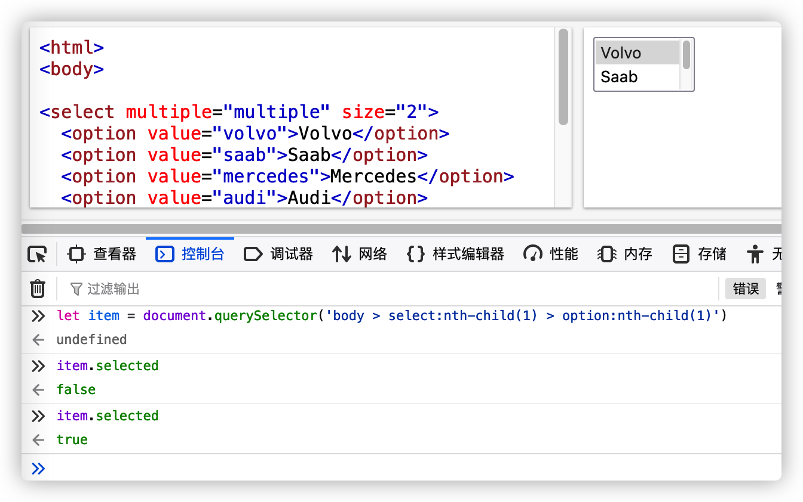
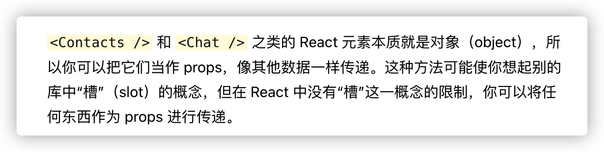

# 9.表单

### 处理多个输入

https://zh-hans.reactjs.org/docs/forms.html#handling-multiple-inputs

当需要处理多个 `input` 元素时，我们可以给每个元素添加 `name` 属性，并让处理函数根据 `event.target.name` 的值选择要执行的操作。

例如：

```jsx
class Reservation extends React.Component {
  constructor(props) {
    super(props);
    this.state = {
      isGoing: true,
      numberOfGuests: 2
    };

    this.handleInputChange = this.handleInputChange.bind(this);
  }

  handleInputChange(event) {
    const target = event.target;
    const value = target.type === 'checkbox' ? target.checked : target.value;
    const name = target.name;
    this.setState({
      [name]: value    });
  }

  render() {
    return (
      <form>
        <label>
          参与:
          <input
            name="isGoing"            type="checkbox"
            checked={this.state.isGoing}
            onChange={this.handleInputChange} />
        </label>
        <br />
        <label>
          来宾人数:
          <input
            name="numberOfGuests"            type="number"
            value={this.state.numberOfGuests}
            onChange={this.handleInputChange} />
        </label>
      </form>
    );
  }
}
```

[**在 CodePen 上尝试**](https://codepen.io/gaearon/pen/wgedvV?editors=0010)

这里使用了 ES6 [计算属性名称](https://developer.mozilla.org/en/docs/Web/JavaScript/Reference/Operators/Object_initializer#Computed_property_names)的语法更新给定输入名称对应的 state 值：

例如：

```jsx
this.setState({
  [name]: value});
```

等同 ES5:

```jsx
var partialState = {};
partialState[name] = value;this.setState(partialState);
```

另外，由于 `setState()` 自动[将部分 state 合并到当前 state](https://zh-hans.reactjs.org/docs/state-and-lifecycle.html#state-updates-are-merged), 只需调用它更改部分 state 即可。

### select 标签

https://zh-hans.reactjs.org/docs/forms.html#the-select-tag

在 HTML 中，`<select>` 创建下拉列表标签。例如，如下 HTML 创建了水果相关的下拉列表：

```jsx
<select>
  <option value="grapefruit">葡萄柚</option>
  <option value="lime">酸橙</option>
  <option selected value="coconut">椰子</option>
  <option value="mango">芒果</option>
</select>
```

请注意，由于 `selected` 属性的缘故，椰子选项默认被选中。React 并不会使用 `selected` 属性，而是在根 `select` 标签上使用 `value` 属性。这在受控组件中更便捷，因为您只需要在根标签中更新它。例如：

```jsx
class FlavorForm extends React.Component {
  constructor(props) {
    super(props);
    this.state = {value: 'coconut'};
    this.handleChange = this.handleChange.bind(this);
    this.handleSubmit = this.handleSubmit.bind(this);
  }

  handleChange(event) {    this.setState({value: event.target.value});  }
  handleSubmit(event) {
    alert('你喜欢的风味是: ' + this.state.value);
    event.preventDefault();
  }

  render() {
    return (
      <form onSubmit={this.handleSubmit}>
        <label>
          选择你喜欢的风味:
          <select value={this.state.value} onChange={this.handleChange}>            <option value="grapefruit">葡萄柚</option>
            <option value="lime">酸橙</option>
            <option value="coconut">椰子</option>
            <option value="mango">芒果</option>
          </select>
        </label>
        <input type="submit" value="提交" />
      </form>
    );
  }
}
```

[**在 CodePen 上尝试**](https://codepen.io/gaearon/pen/JbbEzX?editors=0010)

总的来说，这使得 `<input type="text">`, `<textarea>` 和 `<select>` 之类的标签都非常相似—它们都接受一个 `value` 属性，你可以使用它来实现受控组件。

> 注意
>
> 你可以将数组传递到 `value` 属性中，以支持在 `select` 标签中选择多个选项：
>
> ```jsx
> <select multiple={true} value={['B', 'C']}>
> ```



> 多个选项时 对option节点使用selected可以得到结果


### 处理多个输入

https://zh-hans.reactjs.org/docs/forms.html#handling-multiple-inputs

当需要处理多个 `input` 元素时，我们可以给每个元素添加 `name` 属性，并让处理函数根据 `event.target.name` 的值选择要执行的操作。

例如：

```jsx
class Reservation extends React.Component {
  constructor(props) {
    super(props);
    this.state = {
      isGoing: true,
      numberOfGuests: 2
    };

    this.handleInputChange = this.handleInputChange.bind(this);
  }

  handleInputChange(event) {
    const target = event.target;
    const value = target.type === 'checkbox' ? target.checked : target.value;
    const name = target.name;
    this.setState({
      [name]: value    
    });
  }

  render() {
    return (
      <form>
        <label>
          参与:
          <input
            name="isGoing" type="checkbox"
            checked={this.state.isGoing}
            onChange={this.handleInputChange} />
        </label>
        <br />
        <label>
          来宾人数:
          <input
            name="numberOfGuests" type="number"
            value={this.state.numberOfGuests}
            onChange={this.handleInputChange} />
        </label>
      </form>
    );
  }
}
```

[**在 CodePen 上尝试**](https://codepen.io/gaearon/pen/wgedvV?editors=0010)

这里使用了 ES6 [计算属性名称](https://developer.mozilla.org/en/docs/Web/JavaScript/Reference/Operators/Object_initializer#Computed_property_names)的语法更新给定输入名称对应的 state 值：

例如：

```
this.setState({
  [name]: value});
```

等同 ES5:

```
var partialState = {};
partialState[name] = value;this.setState(partialState);
```

另外，由于 `setState()` 自动[将部分 state 合并到当前 state](https://zh-hans.reactjs.org/docs/state-and-lifecycle.html#state-updates-are-merged), 只需调用它更改部分 state 即可。


### 成熟的解决方案

如果你想寻找包含验证、追踪访问字段以及处理表单提交的完整解决方案，使用 [Formik](https://jaredpalmer.com/formik) 是不错的选择。然而，它也是建立在受控组件和管理 state 的基础之上 —— 所以不要忽视学习它们。

# 10.状态提升

https://zh-hans.reactjs.org/docs/lifting-state-up.html

看demo文件夹的 `状态提升.html`

# 11.组合VS继承

https://zh-hans.reactjs.org/docs/composition-vs-inheritance.html

有种类似插槽的概念



```jsx
function Dialog(props) {
  return (
    <FancyBorder color="blue">
      <h1 className="Dialog-title">
        {props.title}
      </h1>
      <p className="Dialog-message">
        {props.message}
      </p>
      {props.children}    
    </FancyBorder>
  );
}

class SignUpDialog extends React.Component {
  constructor(props) {
    super(props);
    this.handleChange = this.handleChange.bind(this);
    this.handleSignUp = this.handleSignUp.bind(this);
    this.state = {login: ''};
  }

  render() {
    return (
      <Dialog title="Mars Exploration Program"
              message="How should we refer to you?">
        <input value={this.state.login}               
          onChange={this.handleChange} />        
        <button onClick={this.handleSignUp}>          
          Sign Me Up!        
        </button>
      </Dialog>
    );
  }

  handleChange(e) {
    this.setState({login: e.target.value});
  }

  handleSignUp() {
    alert(`Welcome aboard, ${this.state.login}!`);
  }
}
```

这里的input和button组建虽然是插在dialog里面的 但是还是可以调用SignUpDialog组件里面的方法和state

看 `组合.html`

# 无障碍辅助功能

### WAI-ARIA

https://zh-hans.reactjs.org/docs/accessibility.html#wai-aria

JSX 支持所有 `aria-*` HTML 属性。虽然大多数 React 的 DOM 变量和属性命名都使用驼峰命名（camelCased），但 aria-* 应该像其在 HTML 中一样使用带连字符的命名法（也叫诸如 hyphen-cased，kebab-case，lisp-case)。

```jsx
<input
  type="text"
  aria-label={labelText}  aria-required="true"  onChange={onchangeHandler}
  value={inputValue}
  name="name"
/>
```

## 语义化的 HTML

https://zh-hans.reactjs.org/docs/accessibility.html#semantic-html

有时，语义化的 HTML 会被破坏。比如当在 JSX 中使用 `<div>` 元素来实现 React 代码功能的时候，又或是在使用列表（`<ol>`， `<ul>` 和 `<dl>`）和 HTML `<table>` 时。 在这种情况下，我们应该使用 [React Fragments](https://zh-hans.reactjs.org/docs/fragments.html) 来组合各个组件。

举个例子，

```jsx
import React, { Fragment } from 'react';
function ListItem({ item }) {
  return (
    <Fragment>      
      <dt>{item.term}</dt>
      <dd>{item.description}</dd>
    </Fragment>  
  );
}

function Glossary(props) {
  return (
    <dl>
      {props.items.map(item => (
        <ListItem item={item} key={item.id} />
      ))}
    </dl>
  );
}
```

和其他的元素一样，你可以把一系列的对象映射到一个 fragment 的数组中。

```jsx
function Glossary(props) {
  return (
    <dl>
      {props.items.map(item => (
        // Fragments should also have a `key` prop when mapping collections
        <Fragment key={item.id}>          
          <dt>{item.term}</dt>
          <dd>{item.description}</dd>
        </Fragment>      
      ))}
    </dl>
  );
}
```

当你不需要在 fragment 标签中添加任何 prop 且你的工具支持的时候，你可以使用 [短语法](https://zh-hans.reactjs.org/docs/fragments.html#short-syntax)：

```jsx
function ListItem({ item }) {
  return (
    <>      
    <dt>{item.term}</dt>
      <dd>{item.description}</dd>
    </>  
  );
}
```

更多信息请参见 [Fragments 文档](https://zh-hans.reactjs.org/docs/fragments.html)。

### 标记

所有的 HTML 表单控制，例如 `<input>` 和 `<textarea>` ，都需要被标注来实现无障碍辅助功能。我们需要提供屏幕朗读器以解释性标注。

以下资源向我们展示了如何写标注：

- [W3C 向我们展示如何标注元素](https://www.w3.org/WAI/tutorials/forms/labels/)
- [WebAIM 向我们展示如何标注元素](https://webaim.org/techniques/forms/controls)
- [Paciello Group 解释什么是无障碍名称](https://www.paciellogroup.com/blog/2017/04/what-is-an-accessible-name/)

尽管这些标准 HTML 实践可以被直接用在 React 中，请注意 `for` 在 JSX 中应该被写作 `htmlFor`：

```jsx
<label htmlFor="namedInput">Name:</label><input id="namedInput" type="text" name="name"/>
```

### 使用程序管理焦点

我们的 React 应用在运行时会持续更改 HTML DOM，有时这将会导致键盘焦点的丢失或者是被设置到了意料之外的元素上。为了修复这类问题，我们需要以编程的方式让键盘聚焦到正确的方向上。比方说，在一个弹窗被关闭的时候，重新设置键盘焦点到弹窗的打开按钮上。

MDN Web 文档关注了这个问题并向我们解释了可以如何搭建[可用键盘导航的 JavaScript 部件](https://developer.mozilla.org/en-US/docs/Web/Accessibility/Keyboard-navigable_JavaScript_widgets)。

我们可以用 [DOM 元素的 Refs](https://zh-hans.reactjs.org/docs/refs-and-the-dom.html) 在 React 中设置焦点。

用以上技术，我们先在一个 class 组件的 JSX 中创建一个元素的 ref：

```jsx
class CustomTextInput extends React.Component {
  constructor(props) {
    super(props);
    // 创造一个 textInput DOM 元素的 ref    
    this.textInput = React.createRef();  
    }
  render() {
  // 使用 `ref` 回调函数以在实例的一个变量中存储文本输入 DOM 元素  //（比如，this.textInput）。    
  return (
      <input
        type="text"
        ref={this.textInput}      
        />
    );
  }
}
```

然后我们就可以在需要时于其他地方把焦点设置在这个组件上：

```jsx
focus() {
  // 使用原始的 DOM API 显式地聚焦在 text input 上
  // 注意：我们通过访问 “current” 来获得 DOM 节点
  this.textInput.current.focus();
}
```

有时，父组件需要把焦点设置在其子组件的一个元素上。我们可以通过在子组件上设置一个特殊的 prop 来[对父组件暴露 DOM refs](https://zh-hans.reactjs.org/docs/refs-and-the-dom.html#exposing-dom-refs-to-parent-components) 从而把父组件的 ref 传向子节点的 DOM 节点。

```jsx
function CustomTextInput(props) {
  return (
    <div>
      <input ref={props.inputRef} />    </div>
  );
}

class Parent extends React.Component {
  constructor(props) {
    super(props);
    this.inputElement = React.createRef();  }
  render() {
    return (
      <CustomTextInput inputRef={this.inputElement} />    
      );
  }
}

// 现在你就可以在需要时设置焦点了
this.inputElement.current.focus();
```

当使用 [HOC](https://zh-hans.reactjs.org/docs/higher-order-components.html) 来扩展组件时，我们建议使用 React 的 `forwardRef` 函数来向被包裹的组件[转发 ref](https://zh-hans.reactjs.org/docs/forwarding-refs.html)。如果第三方的 HOC 不支持转发 ref，上面的方法仍可以作为一种备选方案。

[react-aria-modal](https://github.com/davidtheclark/react-aria-modal) 提供了一个很好的焦点管理的例子。 这是一个少有的完全无障碍的模态窗口的例子。它不仅仅把初始焦点设置在了取消按钮上（防止键盘用户意外激活成功操作）和把键盘焦点固定在了窗口之内， 关闭窗口时它也会把键盘焦点重置到打开窗口的那一个元素上。

> 注意:
>
> 虽然这是一个非常重要的无障碍辅助功能，但它也是一种应该谨慎使用的技术。 我们应该在受到干扰时使用它来修复键盘焦点，而不是试图预测用户想要如何使用应用程序。

# 代码分割

https://zh-hans.reactjs.org/docs/code-splitting.html

没看懂

# Context

https://zh-hans.reactjs.org/docs/context.html

Context 提供了一个无需为每层组件手动添加 props，就能在组件树间进行数据传递的方法。

全文要求掌握 这里不记了

没怎么看懂

