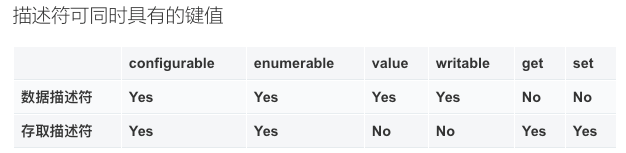
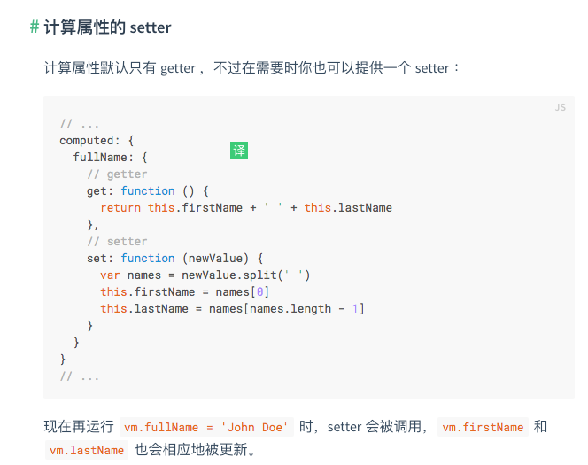

# JS属性描述符之Object.defineProperty()定义对象属性特性

## Object.defineProperty的作用

 用来给对象新增属性，和修改对象中的属性。

## JS对象中的描述符

js对象中两种属性描述符：数据描述符和存取描述符（访问描述符）。

注意事项：

- 数据描述符和存取描述符都具备configurable、enumerable属性。

- 描述符不具备value，writetable，set和get任意一个关键字都被认作一个数据描述符。

- （value或writetable）和（get和set）不能同时存在，然后只要定义了set和get或其中一个都是一个存取描述符（描述符只能是其中一种）。

   

## Object.defineProperty的使用

```js
var o = {}; // 创建一个新对象
 
// 在对象中添加一个属性与数据描述符的示例
Object.defineProperty(o, "a", {
  value : 37,
  writable : true,
  enumerable : true,
  configurable : true
});
 
// 对象o拥有了属性a，值为37
 
// 在对象中添加一个属性与存取描述符的示例
var bValue;
Object.defineProperty(o, "b", {
  get : function(){
    return bValue;
  },
  set : function(newValue){
    bValue = newValue;
  },
  enumerable : true,
  configurable : true
});
 
o.b = 38;
// 对象o拥有了属性b，值为38
```

### writable、enumerable、configurable为false的情况

wirtable：变量不可再被重新赋值
enumerable： 变量不能在遍历器例如for...in和Object.keys()中被读取出来，不可被遍历
configurable：变量不可配置，定义为false之后，不能再为该变量定义配置否则报错。变量被删除(delete)、修改都会无效。

### 如果对象的属性是存取描述符，只会调用定义了的set和get（configurable、enumrable）

在给一个对象属性做赋值操作，在读取属性值时，这个赋值操作赋值的值会被忽略，会去调用定义的get方法的值


以下代码没有看懂

```js
function Archiver() {
  var temperature = null;
  var archive = [];
 
  Object.defineProperty(this, 'temperature', {
     
    set: function(value) {
      temperature = value;
      archive.push({ val: temperature });
    }
  });
 
  this.getArchive = function() { return archive; };
}
 
var arc = new Archiver();
arc.temperature = "67"
console.log(arc.temperature); // undefined
arc.temperature = 11;
arc.temperature = 13;
arc.getArchive(); // [{ val: 11 }, { val: 13 }]
```

## 关于给对象定义set/get方法

​    vue中可以在computed中给变量定义get／set方法（https://cn.vuejs.org/v2/guide/computed.html），结合v-model双向数据绑定变量有很多的用处，比如官网的名字的名和姓的拼接。在子组件中我们想要修改父组件传来的值并及时在dom中渲染的时候。  

​     

computed中给变量定义set／get方法并不是vue中特有的方法，es5中支持了Object.defineProperty,在Object.defineProperty可以给对象的属性设置为访问描述符类型，定义set／get方法。我们除了通过这个方法给属性定义set／get ，还可以通过对象文字语法来定义。

```js
var myObject = {
    get a() {
        return 2
    }
}
myObject.a = 3
console.log(myObject.a)//2
console.log(myObject.b)//undefined
```