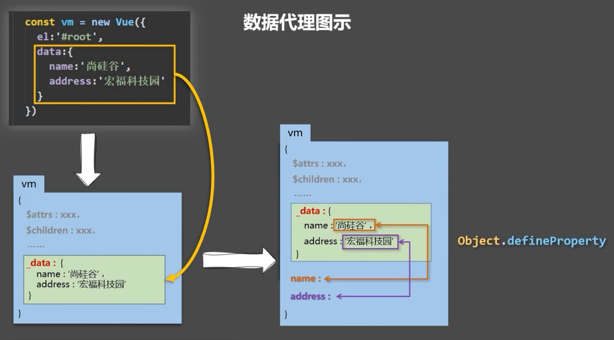

定义Vue实例的时候的数据会被写入_data

但是在控制台直接访问_data显示不出来 因为有数据劫持

使用vm._data.name可以直接访问到

然后再在vm上创建name和address用getter和setter 链接_data下面的name和address 这就是数据代理

```js
let data = {
	name:'xwwwb',
	address:'zzuli'
}
const vm = new Vue({
	el:"#root",
	data //对象简写形式
})
  
```

在控制台输入 vm._data === data 返回是true