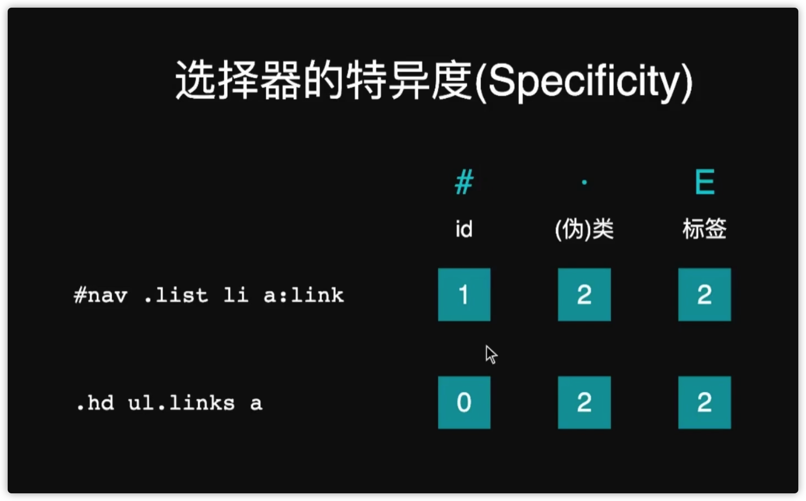
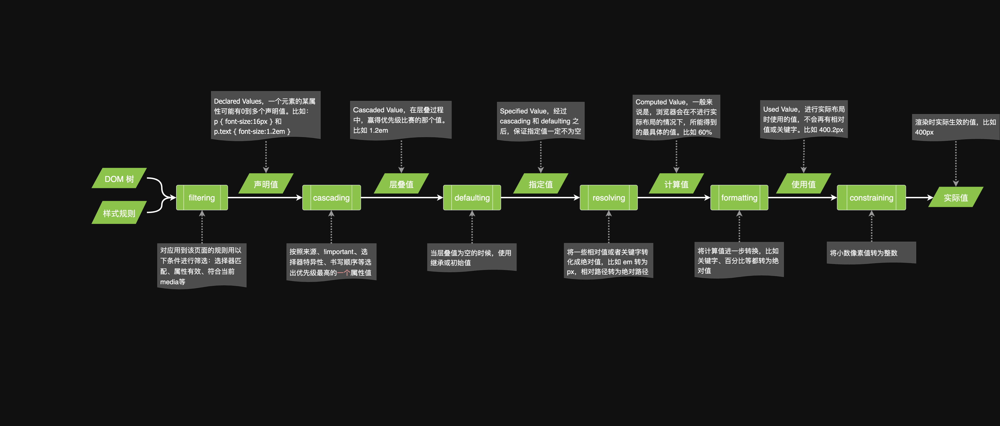

## 选择器

属性选择器

```css
[disabled] {
	color: red;
}
```

## 组合

| 名称       | 语法  | 说明                                 | 示例        |
| ---------- | ----- | ------------------------------------ | ----------- |
| 直接选择器 | AB    | 满足 A 同时满足 B                    | input:focus |
| 后代选择器 | A B   | 满足 A 的后代中满足 B 可以是任意层级 | nav a       |
| 亲子选择器 | A > B | 满足 A 的直接子元素中满足 B          | nav > a     |
| 兄弟选择器 | A ~ B | 选中 B，如果它在 A 后且和 A 同级     | h2 ~ p      |
| 相邻选择器 | A+B   | 选中 B，如果它紧跟着 A 后面          | h2+p        |

https://developer.mozilla.org/zh-CN/docs/Web/CSS/CSS_Selectors

## HSL

H 色相
S 饱和度
L 亮度
这种写法更加直观，更加容易理解

可以看 **CSS3 颜色值标准**

https://www.w3.org/TR/css-color-3/

## 通用字体族

Serif 衬线体
Sans-serif 无衬线体
Monospace 等宽字体
Cursive 手写体
Fantasy 花体

## 选择器优先级

```html
<article>
	<h1 class="title">标题</h1>
	<p>内容</p>
</article>
<style>
	article h1 {
		color: red;
	}
	.title {
		color: blue;
	}
</style>
```

特异度 特殊程度

[优先级 - CSS（层叠样式表） | MDN (mozilla.org)](https://developer.mozilla.org/zh-CN/docs/Web/CSS/Specificity)



## 继承

有些属性可以继承比如在父组件设置了字体颜色

子组件可以继承父组件的字体颜色

但是不能自动继承的可以使用`inherit`手动继承

```css
* {
  box-sizing:inherit;
}

html {
  box-sizing:border-box;
}

/* 然后可以再手动指定 */
.some-widget{
  box-sizing:content-box;
}
```

## 初始值

- css中每个属性都有初始值
  - Background-color 的初始值是transparent
  - margin-left的初始值为0
- 可以使用`initial`关键字显式重置为初始值
  - background-color:initial


## CSS 求值过程

可以点开看大图



 

在子节点继承父元素的数值时

继承的是 计算值 

 